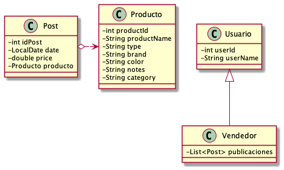

# Sprint Nº1 - Proyecto Bootcamp Backend
## SocialMeli

**Temas:** Git, Java y Spring.

**Autor:** Alejandro Ferrero.

**Email:** alejandro.ferrero@mercadolibre.com

## Consideraciones
 - se consideran vendedores a aquellos usuarios que tienen al menos un posteo.
 - un usuario no puede serguirse (o dejarse de seguir) a sí mismo.
 - solo se pueden seguir a vendedores (aquellos que tienen al menos una publicacion).
 - cada publicación es de solo un producto.
 - los vendedores pueden seguir a otros vendedores.
 - las promociones son consideradas como publicaciones "especiales". 
Estas se guardan en la misma lista con todas las publicaciones y cuando se solicitan las publicaciones de las ultimas dos semanas también se muestran las promociones.
 - para que un usuario pueda seguir a otro, éste debe ser un vendedor, es decir, tener al menos una publicación.
 - los posteos no pueden contener una fecha futura.

### Diagrama de clases del modelo
