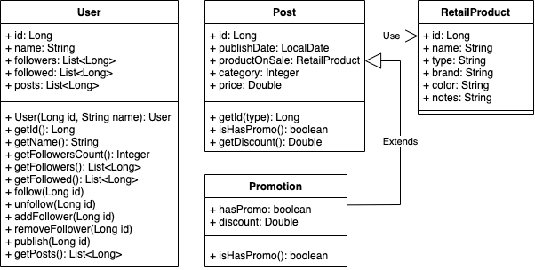

# Documentación SocialMeli

A continuación se presenta la documentación del desafío Spring. Esta incluye el diagrama de entidades del modelo, los
criterios de diseño tomados durante su desarrollo y un listado de los métodos implementados. Para cada uno se muestra su
formato de request, posibles response según su código HTTP y algunos ejemplos de uso.

**Nota:** estos ejemplos se basan en el contenido de los archivos `users-ejemplos.json` y `posts-ejemplos.json`. Para
probarlos tomar su contenido y reemplazar el de los archivos `user.json` y `posts.json` respectivamente.

**Nota 2:** los campos de los payloads tanto de request como response ya se encuentran descritos en la documentación
técnica.

## Diagrama de entidades del modelo

## Criterios

+ Se asume que todos los usuarios pueden seguirse entre sí y pueden convertirse en vendedores al subir una publicación.
+ Se considera error pedir que un usuario siga a uno que ya seguía, así cómo dejar de seguir a uno que no seguía.
+ Se considera un error pasar por parámetro `order` un criterio de ordenamiento no contemplado por el método.

## Métodos

### addFollow (POST)

+ **Request:** `/users/{user_id}/follow/{user_id_to_follow}`  
donde `user_id` es el id del usuario seguidor y `user_id_to_follow` el del seguido.

- **Response:**
  + OK: `"Seguimiento procesado con éxito"`

  - NOT FOUND: `"No se encontraron usuarios con id {user_id}"`  
    donde `user_id` es el id del usuario no encontrado en el repositorio.
  - UNPROCESSABLE ENTITY: `"El usuario {user_id} ya sigue al {user_id_to_follow}"`  
    donde `user_id` es el id del usuario que ya sigue al de id `user_id_to_follow`.
- **Ejemplos:**
  + Request: `localhost:8080/users/2/follow/3`  
    Response: `"Seguimiento procesado con éxito"`

  - Request: `localhost:8080/users/2/follow/4`  
    Response: `"El usuario 2 ya sigue al 4"`

### getFollowersCountOf (GET)

+ **Request:** `"/users/{user_id}/followers/count"`  
donde `user_id` es el id del usuario a obtener su cantidad de seguidores.

- **Response:**
  + OK:
      ~~~
      {
          "user_id": ...,
          "user_name": ...,
          "followers_count": ...
      }
      ~~~

  - NOT FOUND: `"No se encontraron usuarios con id {user_id}"`
- **Ejemplos:**
  + Request: `localhost:8080/users/4/followers/count`  
    Response:
      ~~~
      {
          "user_id": 4,
          "user_name": "mateo_galpesin_1997",
          "followers_count": 2
      }
      ~~~

  - Request: `localhost:8080/users/18/followers/count`  
    Response: `"No se encontraron usuarios con id 18"`

### getFollowersOf (GET)

+ **Request:** `"/users/{user_id}/followers/list?order={criteria}"`  
donde `user_id` es el id del usuario a obtener su lista de seguidores y `criteria` el criterio por el cual ordenar la
lista (es opcional).

- **Response:**
  + OK:
      ~~~
      {
          "user_id": ...,
          "user_name": ...,
          "followers": ...
      }
      ~~~

  - NOT FOUND: `"No se encontraron usuarios con id {user_id}"`
  - BAD REQUEST: `"El parámetro order no es válido"`
- **Ejemplos:**
  + Request: `localhost:8080/users/4/followers/list`  
    Response:
      ~~~
      {
          "user_id": 4,
          "user_name": "mateo_galpesin_1997",
          "followers": [
              {
                  "user_id": 1,
                  "user_name": "carlotem"
              },
              {
                  "user_id": 2,
                  "user_name": "simigaga"
              }
          ]
      }
      ~~~

  - Request: `localhost:8080/users/7/followers/list`
    Response: `"No se encontraron usuarios con id 7"`

### getFollowedBy (GET)

+ **Request:** `"/users/{user_id}/followed/list?order={criteria}"`  
donde `user_id` es el id del usuario a obtener su lista de seguidos y `criteria` el criterio por el cual ordenar la
lista (es opcional).

- **Response:**
  + OK:
      ~~~
      {
          "user_id": ...,
          "user_name": ...,
          "followed": ...
      }
      ~~~

  - NOT FOUND: `"No se encontraron usuarios con id {user_id}"`
  - BAD REQUEST: `"El parámetro order no es válido"
- **Ejemplos:**
  + Request: `localhost:8080/users/1/followed/list?order=name_desc`  
    Response:
      ~~~
      {
          "user_id": 1,
          "user_name": "carlotem",
          "followed": [
              {
                  "user_id": 4,
                  "user_name": "mateo_galpesin_1997"
              },
              {
                  "user_id": 3,
                  "user_name": "julio_88"
              }
          ]
      }
      ~~~

  - Request: `localhost:8080/users/1/followed/list?order=date_desc`  
    Response: `"El parámetro order no es válido"`

### removeFollow (POST)

+ **Request:** `/users/{user_id}/unfollow/{user_id_to_follow}`
donde `user_id` es el id del usuario seguidor y `user_id_to_follow` el del seguido.

- **Response:**
  + OK: `"Seguimiento eliminado con éxito"`

  - NOT FOUND: `"No se encontraron usuarios con id {user_id}"`
  - UNPROCESSABLE ENTITY: `"El usuario {user_id} no sigue al {user_id_to_follow}"`  
    donde `user_id` es el id del usuario que no sigue al de id `user_id_to_follow`.
- **Ejemplos:**
  + Request: `localhost:8080/users/2/unfollow/3`  
    Response: `"Seguimiento eliminado con éxito"`

  - Request: `localhost:8080/users/1/unfollow/2`  
    Response: `"El usuario 1 no sigue al 2"`

### addNewPostBy (POST)

+ **Request:** `"/products/post"`  
Payload:
  ~~~
  {
      "user_id": ...,
      "id_post": ...,
      "date": ...,
      "detail": {
          "product_id": ...,
          "product_name": ...,
          "type": ...,
          "brand": ...,
          "color": ...,
          "notes": ...
      },
      "category": ...,
      "price": ...
  }
  ~~~

- **Response:**
  + OK: `"Publicación subida con éxito"`
  - NOT FOUND: `"No se encontraron usuarios con id {user_id}"`
  - BAD REQUEST: Aquí se pueden presentar diversos mensajes según el caso:
      + `"Ya existe una publicación con id {post_id}"`  
        donde `post_id` es el id de la publicación ya presente en el repositorio.

      - `"Día de publicación inválido"`  
        cuando la fecha de la publicación es posterior a la del sistema.
      - `"Categoría de publicación inválida"`  
        cuando el número de categoría de la publicación no es un natural.
      - `"Precio de publicación inválido"`  
        cuando el precio de la publicación es negativo.
- **Ejemplos:**
  + Request: `"localhost:8080/products/post"`  
    Payload:
      ~~~
      {
          "user_id": 3,
          "id_post": 51,
          "date": "12-11-2021",
          "detail": {
              "product_id": 1,
              "product_name": "Gamer Headband",
              "type": "Gamer",
              "brand": "Racer",
              "color": "Orange",
              "notes": "Deluxe Edition"
          },
          "category": 1,
          "price": 55.90
      }
      ~~~
Response: `"Publicación subida con éxito"`
  + Request: `"localhost:8080/products/post"`  
    Payload:
      ~~~
          {
          "user_id": 4,
          "id_post": 17,
          "date": "12-11-3050",
          "detail": {
              "product_id": 1,
              "product_name": "Gamer Pen",
              "type": "Gamer",
              "brand": "Bic",
              "color": "Blue",
              "notes": "Factory sealed"
          },
          "category": 3,
          "price": 150.33
      }
      ~~~
Response: `"Día de publicación inválido"`
  + Request: `"localhost:8080/products/post"`  
    Payload:
      ~~~
      {
          "user_id": 3,
          "id_post": 4,
          "date": "12-10-2021",
          "detail": {
              "product_id": 1,
              "product_name": "Gamer Knife Set",
              "type": "Gamer",
              "brand": "Almazan",
              "color": "Gold",
              "notes": "Serbian origin"
          },
          "category": 2,
          "price": 3000.00
      }
      ~~~
Response: `"Ya existe una publicación con id 4"`

### getRecentPostsByFollowed (GET)

+ **Request:** `"/products/followed/{user_id}/list?order={criteria}"`  
donde `user_id` es el id del usuario de cuyos seguidores se obtienen sus productos publicados recientemente (dentro de
las últimas 2 semanas)
y `criteria` el criterio por el cual ordenar el listado de productos (es opcional).

- **Response:**
  + OK:
      ~~~
      {
          "user_id": ...,
          "posts": ...
      }
      ~~~

  - NOT FOUND: `"No se encontraron usuarios con id {user_id}"`
  - BAD REQUEST: `"El parámetro order no es válido"`
- **Ejemplos:**
  + Request: `localhost:8080/products/followed/1/list?order=date_asc`  
    Response:
      ~~~
      {
          "user_id": 1,
          "posts": [
              {
                  "id_post": 2,
                  "date": "09-11-2021",
                  "detail": {
                      "product_id": 1,
                      "product_name": "Gamer Headphones",
                      "type": "Gamer",
                      "brand": "Redragon",
                      "color": "Blue",
                      "notes": "Wireless"
                  },
                  "category": 1,
                  "price": 8700.0
              },
              {
                  "id_post": 1,
                  "date": "10-11-2021",
                  "detail": {
                      "product_id": 1,
                      "product_name": "Gamer Keyboard",
                      "type": "Gamer",
                      "brand": "Racer",
                      "color": "Red & Black",
                      "notes": "Special Edition"
                  },
                  "category": 1,
                  "price": 5600.67
              },
              {
                  "id_post": 51,
                  "date": "12-11-2021",
                  "detail": {
                      "product_id": 1,
                      "product_name": "Gamer Headband",
                      "type": "Gamer",
                      "brand": "Racer",
                      "color": "Orange",
                      "notes": "Deluxe Edition"
                  },
                  "category": 1,
                  "price": 55.9
              },
              {
                  "id_post": 4,
                  "date": "15-11-2021",
                  "detail": {
                      "product_id": 1,
                      "product_name": "360 Joystick",
                      "type": "Gamer",
                      "brand": "Microsoft",
                      "color": "Standard",
                      "notes": "Dual analog"
                  },
                  "category": 1,
                  "price": 2500.0
              }
          ]
      }
      ~~~
  + Request: `localhost:8080/products/followed/6/list?order=date_desc`  
    Response: "No se encontraron usuarios con id 6"`

### publishPromo (POST)

+ **Request:** `"/products/promo-post"`  
Payload:
  ~~~
  {
      "user_id": ...,
      "id_post": ...,
      "date": ...,
      "detail": {
          "product_id": ...,
          "product_name": ...,
          "type": ...,
          "brand": ...,
          "color": ...,
          "notes": ...
      },
      "category": ...,
      "price": ...,
      "has_promo": ...,
      "discount": ...
  }
  ~~~
- **Response:**
  + OK: `"Promoción subida con éxito"`
  - NOT FOUND: `"No se encontraron usuarios con id {user_id}"`
  - BAD REQUEST: Aquí se pueden presentar diversos mensajes según el caso:
    + `"Ya existe una publicación con id {post_id}"`
    - `"Día de publicación inválido"`
    - `"Categoría de publicación inválida"`
    - `"Precio de publicación inválido"`
    - `"La publicación no tiene promoción"`  
    cuando el campo `has_promo` de la promoción subida es `false`.
    - `"El valor de descuento es inválido"`  
    cuando el descuento de la promoción es negativo.
- **Ejemplos:**
  + Request: `localhost:8080/products/promo-post`
  Payload:
    ~~~
    {
        "user_id": 4,
        "id_post": 9,
        "date": "16-11-2021",
        "detail": {
            "id": 1,
            "name": "Gamer Toaster",
            "type": "Gamer",
            "brand": "Aiwa",
            "color": "Platinum",
            "notes": "Double slot"
        },
        "category": 4,
        "price": 3100.00,
        "has_promo": true,
        "discount" : 10.0
    }
    ~~~
    Response: `"Promoción subida con éxito"`
  - Request: `localhost:8080/products/promo-post`
    Payload:
    ~~~
    {
        "user_id": 3,
        "id_post": 20,
        "date": "06-09-2021",
        "detail": {
            "id": 1,
            "name": "Gamer Mousepad",
            "type": "Gamer",
            "brand": "Razer",
            "color": "Black",
            "notes": "Limited edition"
        },
        "category": 1,
        "price": 700.00,
        "has_promo": false,
        "discount" : 15.0
    }
    ~~~
    Response: `"La publicación no tiene promoción"`

### getPromotionsCountOf (GET)

+ **Request:** `"/products/{user_id}/promo-post/count"`  
donde `user_id` es el id del usuario a obtener la cantidad de promociones.

- **Response:**
  + OK:
      ~~~
      {
          "user_id": ...,
          "user_name": ...,
          "promo_products_count": ...
      }
      ~~~
  - NOT FOUND: `"No se encontraron usuarios con id {user_id}"`
- **Ejemplos:**
  + Request: `localhost:8080/products/3/promo-post/count`  
  Response:
    ~~~
    {
        "user_id": 3,
        "user_name": "julio_88",
        "promo_products_count": 0
    }
    ~~~
  - Request: `localhost:8080/products/22/promo-post/count`  
  Response: `"No se encontraron usuarios con id 22"`

### getPromotionsOf (GET)

+ **Request:** `"/products/{user_id}/list?order={criteria}"`  
donde `user_id` es el id del usuario a listar sus promociones y `criteria` el criterio por el cual ordenar este listado (es opcional).

- **Response:**
  + OK:
      ~~~
      {
          "user_id": ...,
          "user_name": ...,
          "posts": ...
      }
      ~~~

  - NOT FOUND: `"No se encontraron usuarios con id {user_id}"`
  - BAD REQUEST: `"El parámetro order no es válido"
- **Ejemplos:**
  + Request: `localhost:8080/products/4/list?order=name_asc`  
  Response:
    ~~~
    {
        "user_id": 4,
        "user_name": "mateo_galpesin_1997",
        "posts": [
            {
                "id_post": 9,
                "date": "16-11-2021",
                "detail": {
                    "product_id": null,
                    "product_name": null,
                    "type": "Gamer",
                    "brand": "Aiwa",
                    "color": "Platinum",
                    "notes": "Double slot"
                },
                "category": 4,
                "price": 3100.0,
                "has_promo": true,
                "discount": 10.0
            }
        ]
    }
    ~~~
  - Request: `localhost:8080/products/2/list?order=date_asc`  
  Response: `"El parámetro order no es válido"`
    
