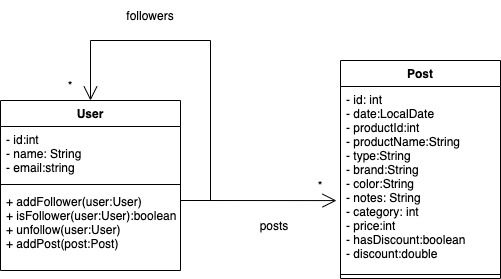
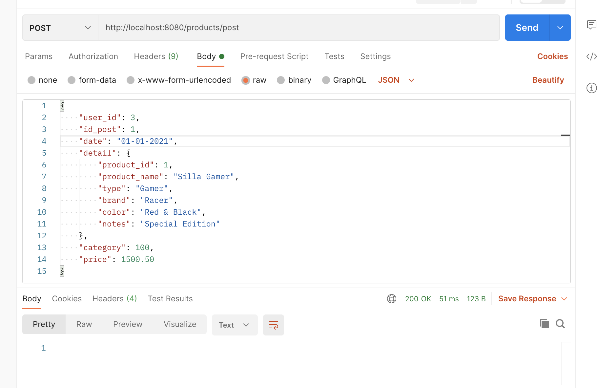
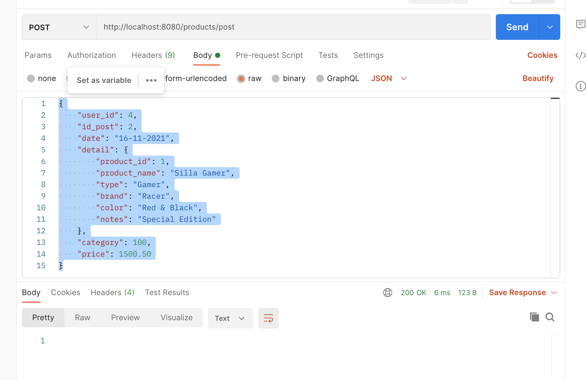
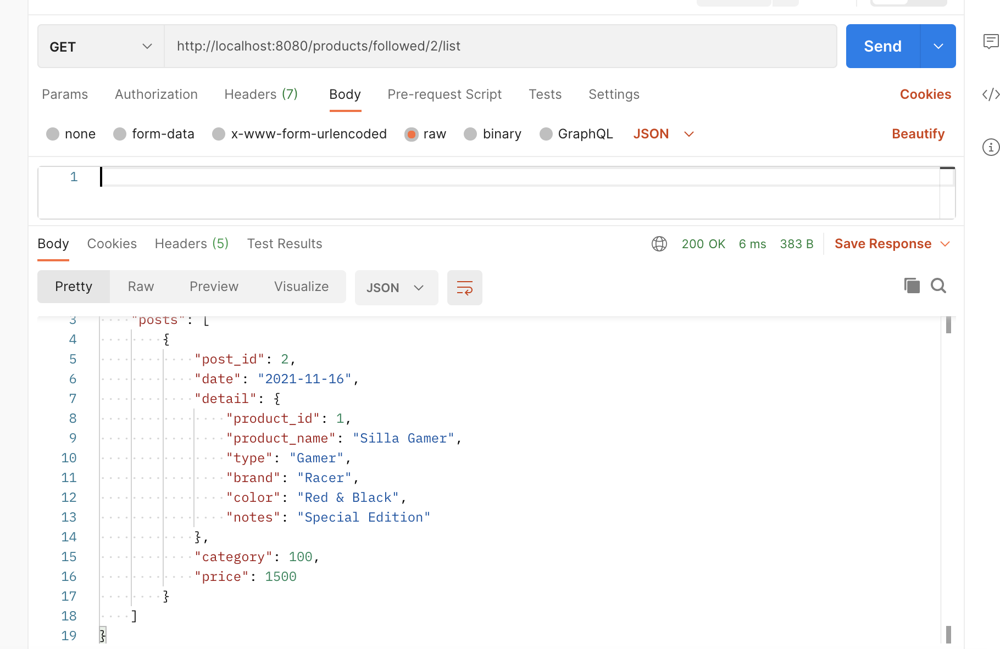
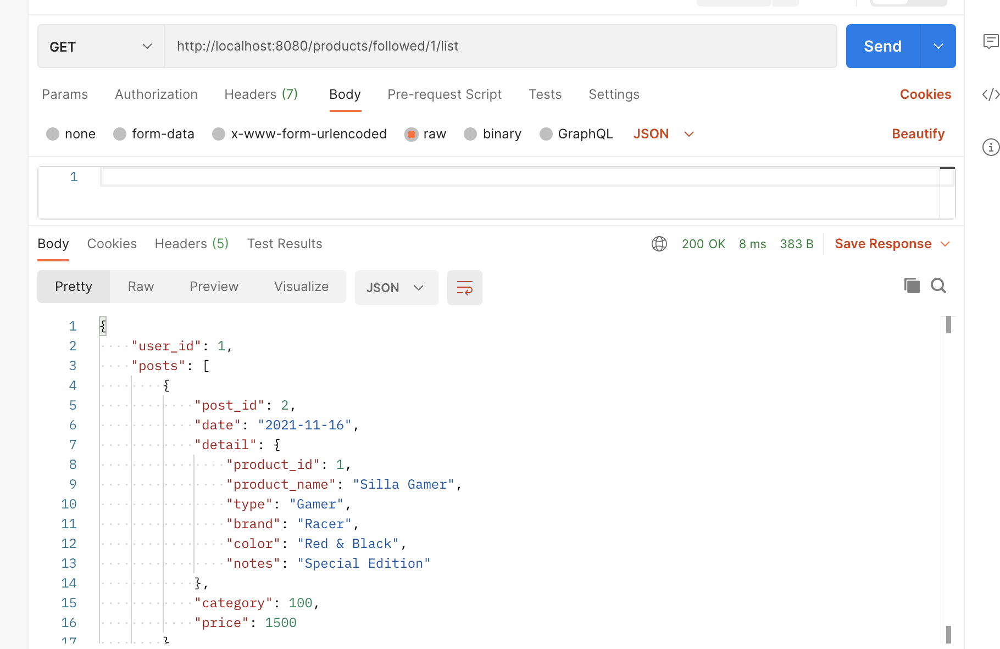
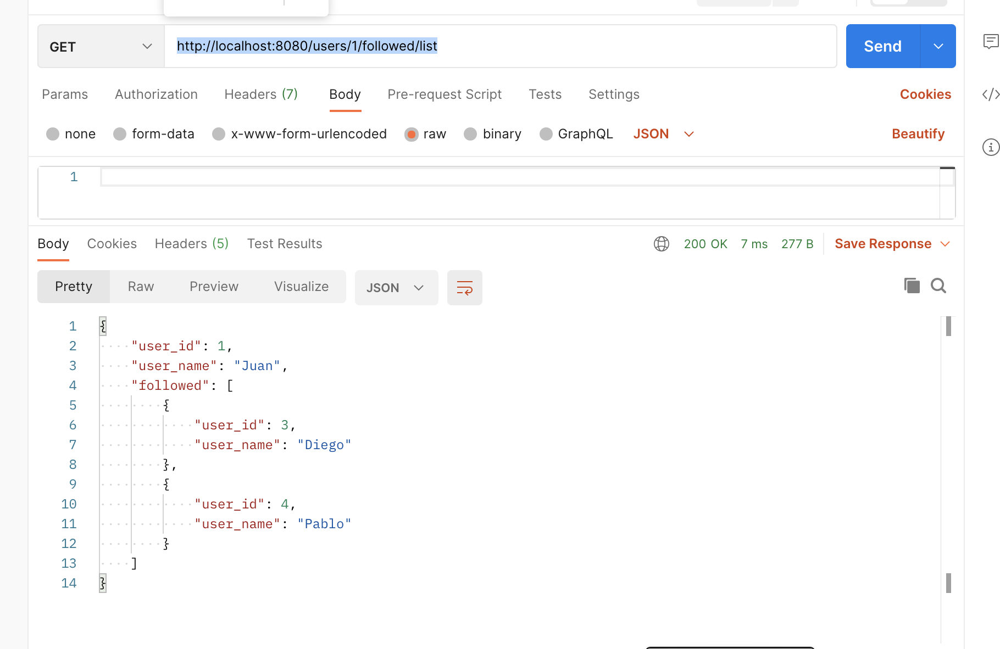
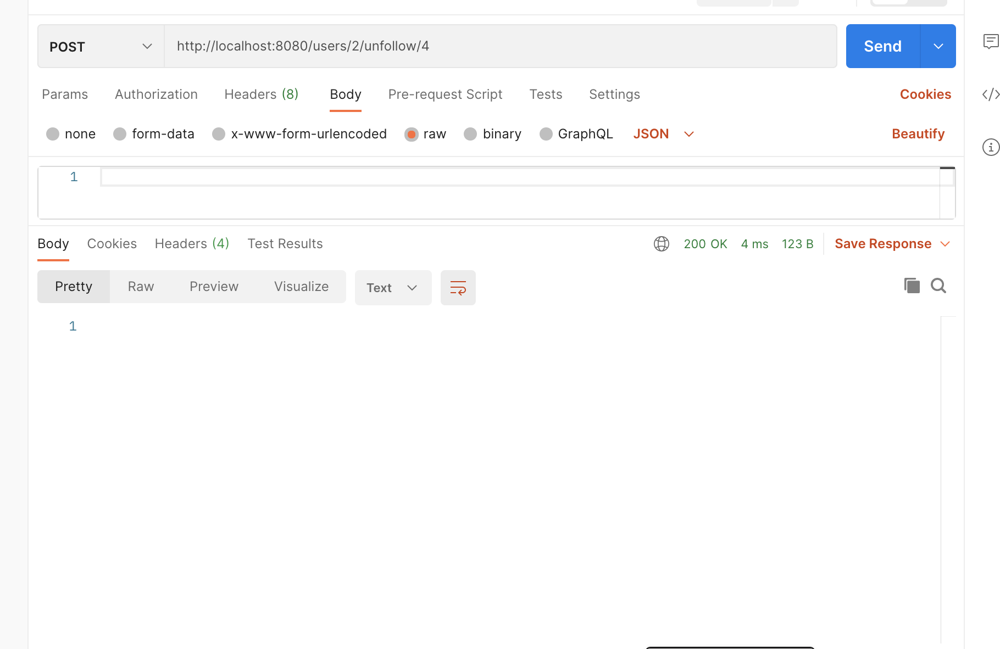

# Documentacion

### Dragramas

**Modelo**

**Project**

### Follow user

POST

URL  http://localhost:8080/users/{userid}/follow/{user_to_follow}

Si el ususario no existe envia 404

Ejemplo:

http://localhost:8080/users/1/follow/8

Si no puede seguir a un usuario envia 400

Ejemplo:

http://localhost:8080/users/1/follow/2

Si lo puede seguir envia 200

Ejemplo:

http://localhost:8080/users/1/follow/4

### conteo usuarios siguiendo a sellers (followers of seller)

GET

URL http://localhost:8080/users/{user_id}/followers/count

Estado correcto

Ejemplo:

http://localhost:8080/users/4/followers/count

Error 404 cuando no existe en usuario

Ejemplo:

http://localhost:8080/users/5/followers/count

Error 400 cuando el usuario no es un vendedor

Ejemplo:

http://localhost:8080/users/1/followers/count

## Lista de seguidores

GET 

URL http://localhost:8080/users/{userId}/followers/list

Correcto

http://localhost:8080/users/3/followers/list

404 si no existe el usuario

http://localhost:8080/users/20/followers/list

400 si no es un vendedor

http://localhost:8080/users/1/followers/list

### Lista de seguidos

GET

URL http://localhost:8080/users/{userId}/followed/list

Correcto

http://localhost:8080/users/1/followed/list

Si el usuario no existe 404

http://localhost:8080/users/20/followed/list

### nuevo Post

POST

URL http://localhost:8080/products/post

payload

    {
        "user_id": 3,
        "id_post": 18,
        "date": "29-04-2021",
        "detail": {
            "product_id": 1,
            "product_name": "Silla Gamer",
            "type": "Gamer",
            "brand": "Racer",
            "color": "Red & Black",
            "notes": "Special Edition"
        },
        "category": 100,
        "price": 1500.50
    }

404 si no existe el usuario
    
Payload 

Ejemplo:

    {
    "user_id": 30,
    "id_post": 18,
    "date": "29-04-2021",
    "detail": {
        "product_id": 1,
        "product_name": "Silla Gamer",
        "type": "Gamer",
        "brand": "Racer",
        "color": "Red & Black",
        "notes": "Special Edition"
    },
    "category": 100,
    "price": 1500.50
    }

400 si el usuario no es seller o existe un post con la misma id para el usuario dado

    {
    "user_id": 1,
    "id_post": 18,
    "date": "29-04-2021",
    "detail": {
        "product_id": 1,
        "product_name": "Silla Gamer",
        "type": "Gamer",
        "brand": "Racer",
        "color": "Red & Black",
        "notes": "Special Edition"
    },
    "category": 100,
    "price": 1500.50
    }

Correcto:

    {
    "user_id": 3,
    "id_post": 18,
    "date": "29-04-2021",
    "detail": {
        "product_id": 1,
        "product_name": "Silla Gamer",
        "type": "Gamer",
        "brand": "Racer",
        "color": "Red & Black",
        "notes": "Special Edition"
    },
    "category": 100,
    "price": 1500.50
    }

### Las publicaciones de los usuarios que sigo de las ultimas 2 semanas

GET

URL http://localhost:8080/products/followed/{user_id}/list

CORRECTO

http://localhost:8080/products/followed/1/list

404 si no existe el usuario

http://localhost:8080/products/followed/90/list

#### Dejar de seguir a un seller

POST

URL http://localhost:8080/users/{subscriptor}/unfollow/{seller}

400 si el usuario a desincribirse no es seller

404 si el usuario no esta inscrito al seller

### Implements orders in previos listing methods

whatch pdf

### agregar un nuevo promo post

POST

URL http://localhost:8080/products/promo-post

Payload

    {
        "user_id": 3,
        "id_post": 18,
        "date": "11-11-2021",
        "detail": {
            "product_id": 1,
            "product_name": "Silla Gamer",
            "type": "Gamer",
            "brand": "Racer",
            "color": "Red & Black",
            "notes": "Special Edition"
        },
        "category": 100,
        "price": 1500.50,
        "has_discount":true,
        "discount":0.25
    }

404 si no existe el usuario

400 si existe un post con el mismo usuario para el usuario dado

### contar todas las promociones (promo post)

GET

URL http://localhost:8080/products/{seller}/promo-post/count

404 si el usuario no existe
 
400 si el usuario no es seller

### Listar todas las publicaciones de promo

GET

URL http://localhost:8080/products/{seller}/list

404 si no existe el usuario

400 si el usuario no es seller

#### Nota: 
Para los items de promocion filtra quienes tengan la bandera hasPromo en true

### Prueba todo ok

**1.** Agregar followers

     POST http://localhost:8080/users/1/follow/3
   
     POST http://localhost:8080/users/1/follow/4
   
     POST http://localhost:8080/users/2/follow/4

**2.** Listar followers en orden

-     GET http://localhost:8080/users/4/followers/list?order=name_asc
     

    El vendedor 4 es seguido por 1 y 2

-       GET http://localhost:8080/users/3/followers/list?order=name_asc

    El vendedor 3 es solo seguido por el usuario 1

**3.** Conteo de followers

-       GET http://localhost:8080/users/3/followers/count

**4.** Añadimos nuevas publicaciones

-       POST http://localhost:8080/products/post
        {
              "user_id": 3,
              "id_post": 1,
              "date": "01-01-2021",
              "detail": {
                  "product_id": 1,
                  "product_name": "Silla Gamer",
                  "type": "Gamer",
                  "brand": "Racer",
                  "color": "Red & Black",
                  "notes": "Special Edition"
              },
              "category": 100,
              "price": 1500.50
          }

-       POST http://localhost:8080/products/post
        {
          "user_id": 4,
          "id_post": 1,
          "date": "01-02-2021",
          "detail": {
              "product_id": 1,
              "product_name": "Silla Gamer",
              "type": "Gamer",
              "brand": "Racer",
              "color": "Red & Black",
              "notes": "Special Edition"
          },
          "category": 100,
          "price": 1500.50
        }

-       POST http://localhost:8080/products/post
        {
          "user_id": 4,
          "id_post": 2,
          "date": "16-11-2021",
          "detail": {
                "product_id": 1,
                "product_name": "Silla Gamer",
                "type": "Gamer",
                "brand": "Racer",
                "color": "Red & Black",
                "notes": "Special Edition"
          },
          "category": 100,
          "price": 1500.50
          }

**5.** Listar las publicaciones de los followed

-       GET http://localhost:8080/products/followed/2/list

-       GET http://localhost:8080/products/followed/1/list

**6.** Lista de followed

-        GET http://localhost:8080/users/1/followed/list

-        GET http://localhost:8080/users/2/followed/list

**7.** Dejar de seguir seller
-       POST http://localhost:8080/users/2/unfollow/4

**8. Ordenar por nombre seguidores**
