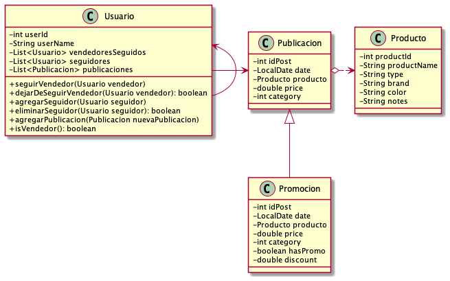

# Sprint Nº1 - Proyecto Bootcamp Backend
## SocialMeli

**Temas:** Git, Java y Spring.

**Autor:** Alejandro Ferrero.

**Email:** alejandro.ferrero@mercadolibre.com

## Consideraciones
 - Se consideran vendedores a aquellos usuarios que tienen al menos un posteo.
 - Un usuario no puede serguirse (o dejarse de seguir) a sí mismo.
 - Solo se pueden seguir a vendedores (aquellos que tienen al menos una publicacion).
 - Se permite que haya usuarios que no sigan a ningún vendedor.
 - Cada publicación es de solo un producto.
 - Un usuario se convierte en vendedor al realizar un posteo.
 - Los vendedores pueden seguir a otros vendedores.
 - Las promociones son consideradas como publicaciones "especiales". 
Estas se guardan en la misma lista con todas las publicaciones y cuando se solicitan las publicaciones de las ultimas dos semanas (US 0006) también se muestran las promociones.
Sin embargo, en este caso no se imprimirá el descuento para mantener compatibilidad con el formato del JSON de la response especificada en US 0006. 
 - Para que un usuario pueda seguir a otro, éste debe ser un vendedor, es decir, tener al menos una publicación.
 - Los posteos no pueden contener una fecha futura.
 - El descuento a aplicar en las promociones debe estar comprendido entre el 0% y el 100%.
 - Debido a que únicamente los vendedores pueden tener seguidores, toda consulta acerca de la cantidad o lista de seguidores que 
se realice sobre un usuario no vendedor devolverá un mensaje de error (con un código 400 - Bad Request).

### Diagrama de clases del Modelo
A continuación se muestra el diagrama de clases que contiene los objetos del dominio del problema y sus relaciones.

## Nuevas Features
Esta versión de SocialMeli permite la creación de nuevos usuarios. 
La misma se realiza mediante un POST al endpoint /users/new.

**POST** /users/new

**Request:**

    {
        "user_id" : 123,
        "user_name" : "usuario123"
    }

**Response:**
 - Status Code 200 (todo OK)
 - Status Code 400 (Bad Request)

En principio, los nuevos usuarios creados serán usuarios comunes (no vendedores) y no seguirán a nadie ni tendrán seguidores.
Sin embargo, se pueden utilizar los otros endpoints de la aplicación para modificar estas características, es decir, que este nuevo usuario
comience a tener publicaciones, a seguir a otros vendedores y tener sus seguidores.