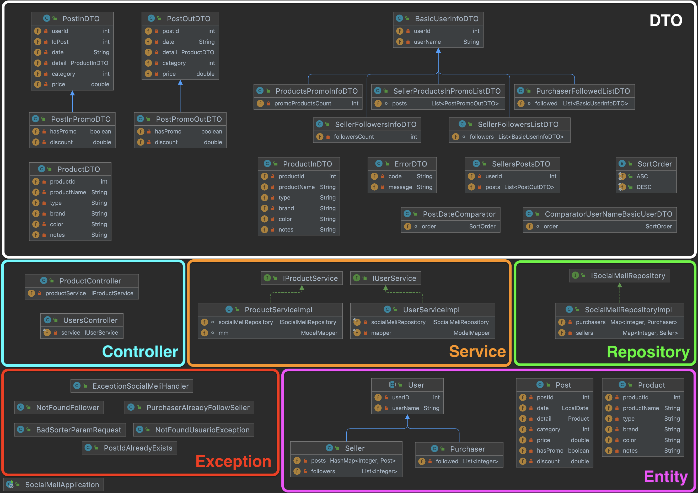

# Social MeLi

### INTRODUCCIÓN

Mercado Libre sigue creciendo y para el año que viene tiene como objetivo empezar a 
implementar una serie de herramientas que permitan a los compradores y vendedores tener
una experiencia totalmente innovadora, en donde el lazo que los una sea mucho más cercano.
Por lo cual es necesaria la presentación de una versión Beta de lo que va a ser conocido 
como “SocialMeli”, en donde los compradores van a poder seguir a sus vendedores favoritos
y enterarse de todas las novedades que los mismos posteen.


### ARQUITECTURA DEL SISTEMA



### REQUERIMIENTOS DEL SISTEMA

1. **US 0001:** Poder realizar la acción de "Follow" (seguir) a un determinado vendedor.

    * **Restricciones:** En el sistema se tienen 2 tipos de usuario, Purchaser(comprador)
    y Seller(vendedor). Dado lo anterior, un usuario comprador solo podrá seguir a un usuario vendedor
    y un usuario vendedor solo podrá ser seguido. Por otro lado, los usuarios deben existir previamente
    en el repositorio. Adicionalmente, un usuario no podrá seguir multiples veces a otro usuario.
    
    - **Usuarios en el repositorio:** 
           
        | id_user| Rol | 
        | :---   |:---:|
        | **1**  |Comprador|
        | **2**  |Comprador|
        | **3**  |Vendedor|
        | **4**  |Vendedor|
   
      **Nota:** Nadie sigue a nadie, nadie tiene publicaciones.
    
    **Entradas:**
   
      | Method | END-PONT |
      | :---       |     :---:   |
      | **POST**   |  [localhost:8080/users/{user_id}/follow/{user_id_to_follow}]() |
      | **Ejemplo** | [localhost:8080/users/1/follow/4]() |
    
3. **US 0002:** Obtener el resultado de la cantidad de usuarios que siguen a un determinado vendedor.

    * **Restricciones:** Dada la restricción del requerimiento US0001, el id ingresado deberá
    corresponder al de un usuario vendedor y deberá existir previamente en el repositorio,
    en caso contrario se lanzará una excepción.
   
    **Entradas:**

      | Method | END-PONT |
      | :---       |     :---:   |
      | **GET**   |  [localhost:8080/users/{user_id}/followers/count]() |
      | **Ejemplo** | [localhost:8080/users/4/followers/count]() |

4. **US 0003:** Obtener un listado de todos los usuarios que siguen a un determinado vendedor (¿Quién me sigue?)

    * **Restricciones:** Dada la restricción del requerimiento US0001, el id ingresado deberá
      corresponder al de un usuario vendedor y deberá existir previamente en el repositorio,
      en caso contrario se lanzará una excepción.

    **Entradas:**

      | Method | END-PONT |
      | :---        |     :---:   |
      | **GET**   |  [localhost:8080/users/{user_id}/followers/list]() |
      | **Ejemplo**  | [localhost:8080/users/4/followers/list]() |

5. **US 0004:** Obtener un listado de todos los vendedores a los cuales sigue un determinado usuario (¿A quién sigo?)

    * **Restricciones:** Dada la restricción del requerimiento US0001, el id ingresado deberá
      corresponder al de un usuario comprador y deberá existir previamente en el repositorio,
      en caso contrario se lanzará una excepción.

    **Entradas:**

      | Method | END-PONT |
      | :---        |     :---:   |
      | **GET**   |  [localhost:8080/users/{user_id}/followed/list]() |
      | **Ejemplo**  | [localhost:8080/users/1/followed/list]() |

    
5. **US 0005:** Dar de alta una nueva publicación

    * **Restricciones:** Debe existir el usuario vendedor al cual se 
    le asignará el correspondiente post. Por otro lado, el id de un post
   será único, es decir, no podrán existir 2 posts con el mismo id.

    **Entradas:**

      | Method | END-PONT |
      | :---        |     :---:   |
      | **POST**   |  [localhost:8080/products/post]() |
      | **Ejemplo**  | [localhost:8080/products/post]() |

    **Ejemplo Body**:

   ````
      {
         "user_id": 4,
         "id_post": 3,
         "date": "06-11-2021",
         "detail": {
             "product_id": 1,
             "product_name": "Silla n",
             "type": "Gamer",
             "brand": "Racer",
             "color": "Red & Black",
             "notes": "Special Edition"
         },
         "category": 100,
         "price": 1500.50
      }
   ````

6. **US 0006:** Obtener un listado de las publicaciones realizadas por los vendedores que 
un usuario sigue en las últimas dos semanas (para esto tener en cuenta ordenamiento por fecha,
publicaciones más recientes primero).

    * **Restricciones:** El id ingresado debe corresponder al de un usuario comprador existente.

    **Entradas:**

      | Method | END-PONT |
      | :---        |     :---:   |
      | **GET**   |  [localhost:8080/products/followed/{user_id}/list]() |
      | **Ejemplo**  | [localhost:8080/products/followed/1/list]() |

7. **US 0007:** Poder realizar la acción de "Unfollow" (dejar de seguir) a un determinado vendedor.

    * **Restricciones:** user_id deberá corresponder al id de un usuario comprador,
    por otro lado, user_id_to_unfollow deberá corresponder a un usuario vendedor. 
    Debe tenerse en cuenta, que un usuario no puede dejar de seguir a otro usuario,
    si actualmente no es un seguidor de este.
    
    **Entradas:**

      | Method | END-PONT |
      | :---       |     :---:   |
      | **GET**   |  [localhost:8080/users/{user_id}/unfollow/{user_id_to_unfollow}]() |
      | **Ejemplo** | [localhost:8080/users/2/unfollow/4]() |

8. **US 0008:** Ordenamiento alfabético ascendente y descendente.

    * **Restricciones:** Los usuarios deben existir en el correspondiente Rol. 
    Adicionalmente, el parámetro "name_" debe estar escrito correctamente, así 
    como el orden seleccionado "asc" o "desc". 

    **Entradas:**

      | Method | END-PONT |
      | :---       |     :---:   |
      | **GET**   |  [localhost:8080/users/{user_id}/followers/list]() |
      | **Ejemplo** | [localhost:8080/users/4/followers/list?order=name_asc]() |
      | **Ejemplo** | [localhost:8080/users/4/followers/list?order=name_desc]() |
      | **GET**   |  [localhost:8080/users/{user_id}/followed/list]() |
      | **Ejemplo** | [localhost:8080/users/1/followed/list?order=name_asc]() |
      | **Ejemplo** | [localhost:8080/users/1/followed/list?order=name_desc]() |
    

9. **US 0009:** Ordenamiento por fecha ascendente y descendente.

    * **Restricciones:** Los usuarios deben existir en el correspondiente Rol. 
      Adicionalmente, el parámetro "date_" debe estar escrito correctamente, así
      como el orden seleccionado "asc" o "desc".

   **Entradas:**

   | Method | END-PONT |
   | :---       |     :---:   |
   | **GET**   |  [localhost:8080/products/followed/{user_id}/list]() |
   | **Ejemplo** | [localhost:8080/products/followed/1/list?order=date_asc]() |
   | **Ejemplo** | [localhost:8080/products/followed/1/list?order=date_desc]() |


10. **US 0010:** Llevar a cabo la publicación de un nuevo producto en promoción.

    * **Restricciones:** Debe existir el usuario vendedor al cual se
      le asignará el correspondiente post. Por otro lado, el id de un post
      será único, es decir, no podrán existir 2 posts con el mismo id,
      indiferentemente de que se encuentre o no en promoción, deberá tener
      un id diferente.

    **Entradas:**

    | Method | END-PONT |
    | :---        |     :---:   |
    | **POST**   |  [localhost:8080/products/promopost]() |
    | **Ejemplo**  | [localhost:8080/products/promopost]() |

    **Ejemplo Body**:

       ````
      {
         "user_id": 4,
         "id_post": 6,
         "date": "06-11-2021",
         "detail": {
             "product_id": 1,
             "product_name": "Silla Promo",
             "type": "Gamer",
             "brand": "Racer",
             "color": "Red & Black",
             "notes": "Special Edition"
         },
         "category": 100,
         "price": 1500.50,
         "has_promo": true,
         "discount":0.10
      }
    ````

11. **US 0011:** Obtener la cantidad de productos en promoción de un determinado vendedor

    * **Restricciones:** El parámetro user_id, deberá corresponder al id de un usuario vendedor
    que exista previamente en el repositorio.

    **Entradas:**

    | Method | END-PONT |
    | :---        |     :---:   |
    | **POST**   |  [localhost:8080/products/{user_id}/promo-post/count]() |
    | **Ejemplo**  | [localhost:8080/products/4/promo-post/count]() |
    

12. **US 0012:** Obtener un listado de todos los productos en promoción de un determinado vendedor.

* **Restricciones:** El parámetro user_id, deberá corresponder al id de un usuario vendedor
  que exista previamente en el repositorio.

  **Entradas:**

    | Method | END-PONT |
    | :---        |     :---:   |
    | **POST**   |  [localhost:8080/products/{user_id}/list]() |
    | **Ejemplo**  | [localhost:8080/products/4/list]() |
    