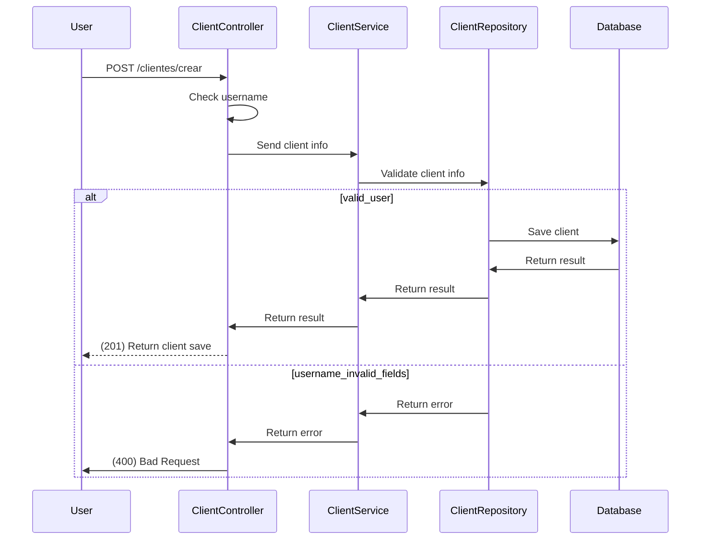
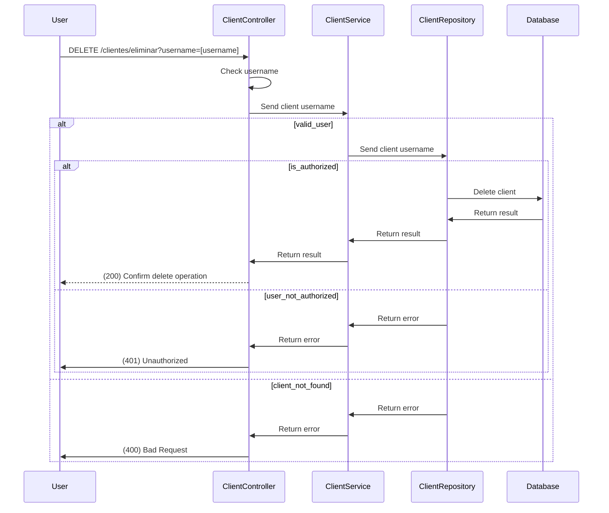
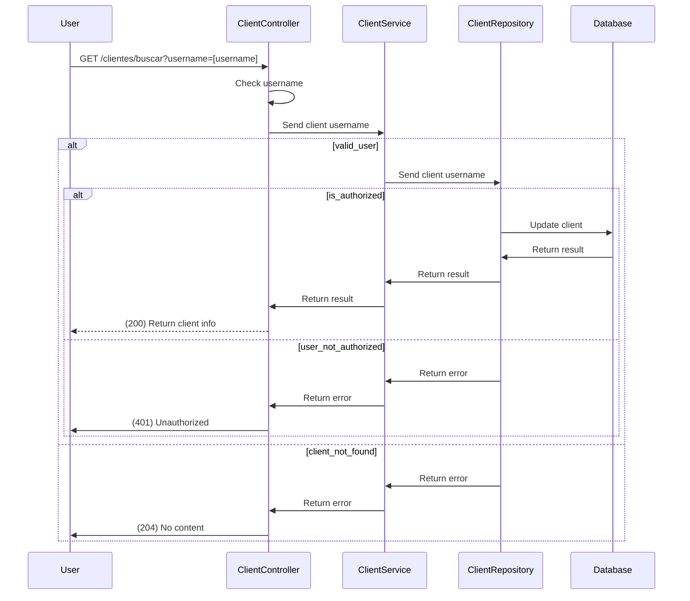
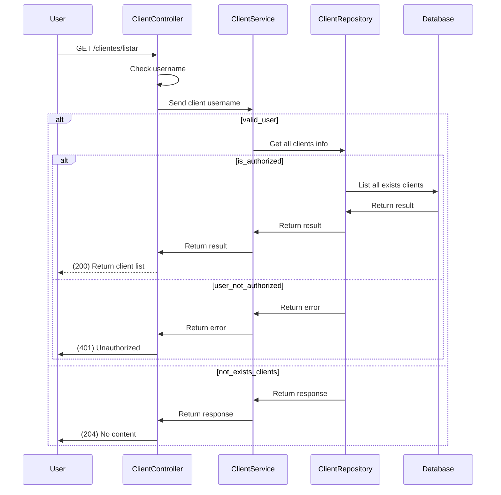

#Use cases

### Create new client

POST /clients/crear



### Delete exist client
DELETE /clientes/eliminar?username=[username]



### Update exists client
PUT /clientes/actualizar

```mermaid
participant U as User
participant C as ClientController
participant S as ClientService
participant R as ClientRepository
participant D as Database

U->>C: PUT /clientes/actualizar
C->>C: Check username
C->>S: Send client info
alt valid_user
    S->>R: Send client info
    alt is_authorized
        R->>D: Update client
        D->>R: Return result
        R->>S: Return result
        S->>C: Return result 
        C-->>U: (200) Confirm update operation
    else user_not_authorized
        R->>S: Return error
        S->>C: Return error 
        C->>U: (401) Unauthorized
    end
else client_not_found
    R->>S: Return error
    S->>C: Return error 
    C->>U: (400) Bad Request
end
```

### Search specific client
GET clientes/buscar?username=xxxxxx



### List all exists clients
GET /clientes/listar

